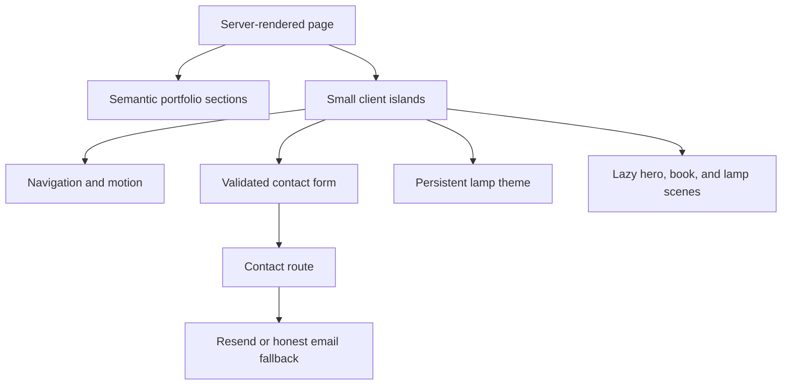

# Signal Atelier — 3D Portfolio

Signal Atelier is Nima Moradirad's production-minded portfolio, built with Next.js, React, TypeScript, Tailwind CSS, React Three Fiber, and Motion. It turns his résumé into a spatial narrative: a live signal core introduces the work, scroll turns the pages of a procedural 3D experience book, and a pull-chain reading lamp controls the atmosphere of the entire room.

The content, portrait, public links, experience, skills, education, and projects are adapted from the supplied résumé. The downloadable PDF is a public-safe copy with the private phone number removed.

## Creative concept

The visual language treats a career as a signal that becomes clearer as it travels. A procedural 3D core is the identity anchor; the experience reader makes scrolling a physical page-turning input; and the persistent 3D lamp makes theme selection part of the environment. Circular fields, orbital lines, precise grids, and monospaced coordinates carry the metaphor through the rest of the interface.

Three.js is used where depth changes the interaction—not as a generic backdrop. The hero, book, and lamp are separate focused scenes; off-screen hero and book render loops pause automatically. All critical content remains semantic HTML outside WebGL.

## Preview

After running the site locally, open `http://localhost:3000`. Verified desktop and mobile screenshots are stored in `docs/previews/` when generated by the QA workflow.

## Major features

- Procedural Three.js identity sculpture with pointer response and adaptive DPR
- Scroll-controlled 3D book with curved, dynamically turning experience pages
- Previous/next and arrow-key controls synchronized with the book's scroll position
- Interactive 3D reading lamp with draggable/clickable pull chain
- Persistent light and dark themes with a 650-millisecond color-system transition
- Dynamic loading of the WebGL bundle after the semantic page is available
- Static and motion-safe fallbacks for unsupported WebGL, loading failure, and reduced-motion preferences
- Server-rendered portfolio narrative with focused client boundaries
- Fully responsive desktop, tablet, and mobile compositions
- Keyboard-accessible navigation, visible focus states, skip link, and semantic landmarks
- `prefers-reduced-motion`, high-contrast, touch, and forced-colors adaptations
- Accessible React Hook Form + Zod contact experience
- Server-side validation, honeypot protection, best-effort rate limiting, and optional Resend delivery
- Honest email fallback when delivery credentials are absent
- Metadata, JSON-LD, dynamic Open Graph art, icon, sitemap, robots, and web manifest
- Unit tests, Playwright flows, axe checks, linting, type checking, formatting, and bundle analysis scripts

## Technology stack

| Layer      | Choice                                      | Why                                                      |
| ---------- | ------------------------------------------- | -------------------------------------------------------- |
| Framework  | Next.js 16 App Router                       | Server-first rendering, metadata routes, deployment fit  |
| UI         | React 19 + TypeScript + Radix primitives    | Typed, accessible component boundaries                   |
| Styling    | Tailwind CSS 4 + semantic CSS tokens        | Utility-first composition with scoped artwork exceptions |
| 3D         | Three.js + React Three Fiber + Drei         | Declarative scene graph and adaptive rendering helpers   |
| Motion     | Motion                                      | Reduced-motion-aware reveal and interaction primitives   |
| Forms      | React Hook Form + Zod                       | Shared client/server validation contract                 |
| Tests      | Vitest + Testing Library + Playwright + axe | Unit, interaction, browser, and accessibility coverage   |
| Deployment | Liara Next.js platform                      | Managed production releases from GitHub Actions          |

## Architecture



The page and content remain server-rendered. Client JavaScript is limited to the mobile menu, theme lamp, scroll reader, reveal animation, form behavior, and dynamically loaded scenes.

## Directory structure

```text
src/
  app/                    App Router page, metadata files, and contact route
  components/
    experience/           Scroll reader, 3D book, and motion-safe fallback
    layout/               Header and footer
    motion/               Reusable reveal primitive
    sections/             Portfolio sections and contact form
    three/                WebGL scene, loader, fallback, and error boundary
    theme/                Theme state, 3D lamp, chain control, and fallback
    ui/                   Small design-system primitives
  content/portfolio.ts    All editable résumé-dependent content
  hooks/                  Capability detection
  lib/                    Validation, site config, tokens, and utilities
  types/                  Shared content types
tests/
  unit/                   Vitest tests
  e2e/                    Playwright and axe flows
docs/
  previews/               QA screenshots
public/
  assets/                 User-provided portrait
  nima-moradirad-resume.pdf  Public-safe downloadable résumé
```

## Local installation

Requirements: Node.js 20.9 or newer and npm 10 or newer.

```bash
npm install
cp .env.example .env.local
npm run dev
```

Open `http://localhost:3000`.

## Commands

```bash
npm run dev            # local development
npm run build          # optimized production build
npm run start          # serve the production build
npm run lint           # ESLint
npm run typecheck      # TypeScript without emitting files
npm run test           # unit tests
npm run test:coverage  # unit coverage report
npm run test:e2e       # browser and axe flows
npm run format         # apply Prettier formatting
npm run format:check   # verify formatting
npm run analyze        # build with bundle analyzer enabled
```

## Environment variables

Copy `.env.example` to `.env.local`.

| Variable                    | Required          | Purpose                                       |
| --------------------------- | ----------------- | --------------------------------------------- |
| `NEXT_PUBLIC_SITE_URL`      | Before publishing | Canonical metadata, sitemap, and social links |
| `NEXT_PUBLIC_CONTACT_EMAIL` | Before publishing | Visible email and mailto fallback             |
| `RESEND_API_KEY`            | Optional          | Enables direct form delivery                  |
| `CONTACT_DESTINATION_EMAIL` | With Resend       | Inbox that receives submissions               |
| `CONTACT_FROM_EMAIL`        | With Resend       | Verified Resend sender identity               |

Without the three Resend values, the route returns a clear “not sent” state and a prefilled email link. It never simulates delivery.

## Content editing

Update `src/content/portfolio.ts` first when Nima's résumé changes. Keep these areas aligned:

1. Identity, role, location, status, and positioning copy
2. Experience dates, companies, roles, summaries, and highlights
3. Projects, verified contributions, current links, and technology choices
4. Skills, education, languages, and social profiles
5. The public-safe PDF and portrait under `public/`

Do not add metrics or outcomes that are not supported by the résumé or another verified source.

## Adding project assets

The current project visuals are original CSS/procedural forms, so the repository has no fragile remote imagery. To add real project images:

1. Place optimized AVIF/WebP files under `public/assets/images/`.
2. Add width, height, and meaningful alt text.
3. Render them with `next/image` in `projects-section.tsx`.
4. Update `ASSET_LICENSES.md` with ownership or license details.

If adding GLB files, keep them under `public/assets/models/`, compress them with Meshopt or Draco where beneficial, and preserve the non-WebGL content path.

## Résumé download

The hero and footer link to `public/nima-moradirad-resume.pdf`. This public-safe copy retains the résumé content and removes the private phone number. If the source résumé changes, regenerate the public version and re-check it visually before publishing.

## Performance strategy

The full rationale and budgets are in `PERFORMANCE.md`. In short: semantic HTML arrives first; WebGL is dynamically imported; all scenes use procedural geometry, bounded DPR, no textures or postprocessing, and off-screen render-loop suspension; motion honors user preferences.

## Accessibility strategy

- Critical information exists outside the canvas.
- Heading order and landmarks follow document structure.
- Navigation and forms use native controls.
- Focus is always visible.
- Form errors are associated with their fields and status changes use an ARIA live region.
- Motion, contrast, touch, and keyboard adaptations are included.
- The canvas is decorative to assistive technology; its meaning is represented by nearby text.

See `DESIGN_SYSTEM.md` for the full interaction and accessibility rules.

## Liara deployment

Production is deployed to the Liara app `nimamoradirad` from the `main` branch by
`.github/workflows/deploy-liara.yml`. The workflow validates the project, builds it,
and deploys it with Liara CLI 9. Concurrent pushes cancel an older in-progress
deployment so the newest `main` commit is the release that goes live.

One repository secret is required in GitHub under **Settings > Secrets and
variables > Actions**:

- `LIARA_API_TOKEN`: an API token created in the Liara console

The Liara app must use the Next.js platform, Node.js 22, and port 3000, matching
`liara.json`. Keep production environment variables in the Liara app rather than
GitHub. At minimum, set `NEXT_PUBLIC_SITE_URL=https://nimamoradirad.com`; add the
contact-related values listed above when direct contact delivery is enabled.

After the one-time secret is present, every push to `main` triggers the deployment.
The same workflow can also be rerun manually from the GitHub **Actions** tab.

## Security and privacy

- Secrets are read only inside the server route.
- Contact input is validated on both client and server.
- Payload size, a honeypot, and best-effort in-memory rate limiting provide a lightweight first layer.
- No analytics or trackers are installed.
- External links use safe `rel` attributes.
- Security headers are configured in `next.config.js`.

For high-volume production use, replace the in-memory rate limiter with a durable distributed service and add a managed bot challenge.

## Troubleshooting

### A 3D scene does not render

The site automatically substitutes an intentional static sculpture, CSS book, lamp, or motion-safe experience list. Check hardware acceleration and browser WebGL support. The complete portfolio content and theme control remain usable either way.

### Fonts or packages fail during installation

Use a currently supported Node.js version, remove only your local `node_modules`, and run `npm install` again. The lockfile is the dependency source of truth.

### The contact form offers email instead of sending

This is expected until all Resend environment variables are configured. Verify the sender domain in Resend and confirm the values are available to the deployment.

### Playwright cannot launch a browser

Install the browser once:

```bash
npx playwright install chromium
```

Then run `npm run test:e2e` again.

## Known limitations and assumptions

- The portfolio reflects the supplied résumé; future résumé changes are not synchronized automatically.
- The Full-Stack Blog Application is intentionally marked archived because its résumé-listed domain is inactive.
- Direct contact delivery is optional and disabled without credentials.
- Safari verification depends on access to macOS/WebKit in the target QA environment.
- The in-memory rate limiter is per runtime instance, not a durable global abuse-control layer.
- Lighthouse scores vary with hardware, browser extensions, development mode, and network conditions. Test the production build.

## Documentation

- `DESIGN_SYSTEM.md` — visual, component, motion, 3D, responsive, and accessibility rules
- `PERFORMANCE.md` — performance budgets and tradeoffs
- `RESEARCH.md` — inspiration and implementation principles
- `ASSET_LICENSES.md` — asset provenance and licenses
- `VERIFICATION.md` — executed checks and environment limitations

## License

The project source is provided under the MIT License. Personal résumé content and user-provided assets remain Nima Moradirad's content. Third-party packages retain their own licenses.
